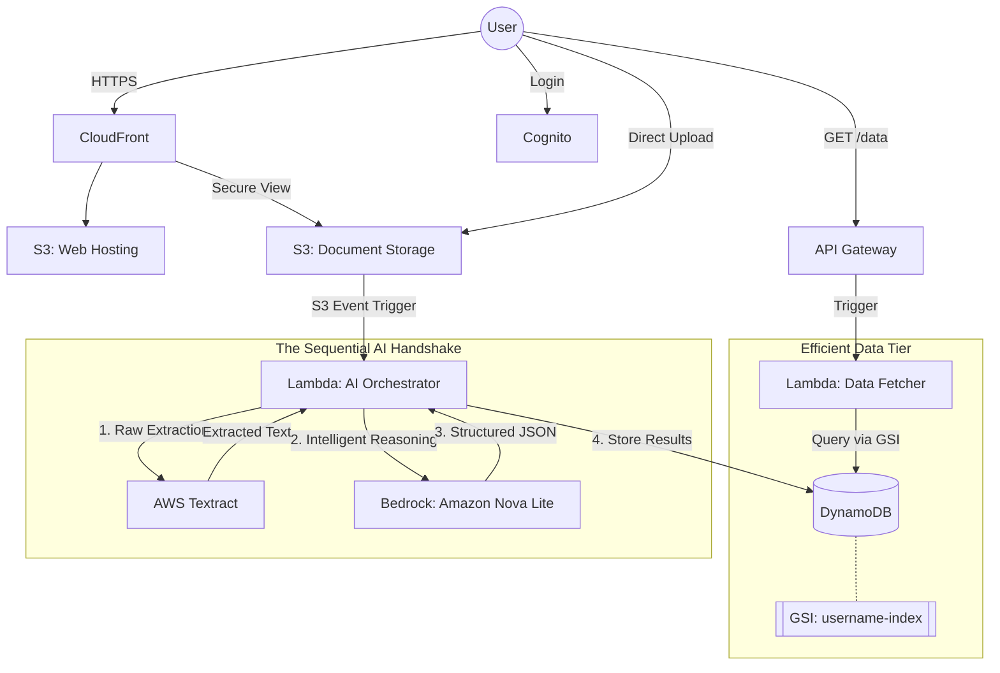
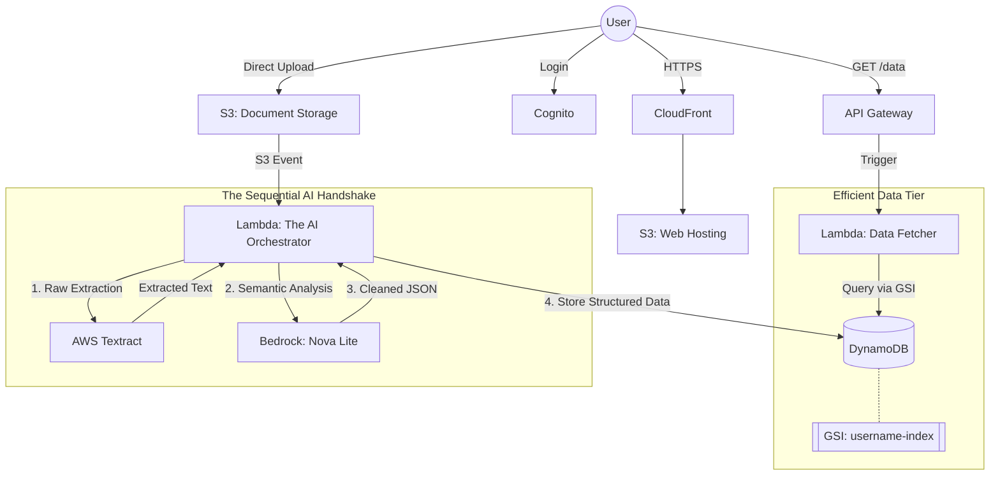

# AI Document Parser (Nexus)

A sophisticated, cloud-native document automation platform designed to streamline the extraction and analysis of business-critical documents. This project demonstrates a production-ready integration of modern frontend technologies with AWS cloud services.

## 🚀 Overview
The **AI Document Parser** provides a seamless, secure, and intelligent environment for managing various document types. It leverages AWS's robust infrastructure to handle everything from secure user authentication to high-speed document processing and structured data visualization.

---

## 🛠 Tech Stack
| Tier | Technologies |
| :--- | :--- |
| **Frontend** | React 19 (Vite), Tailwind CSS 4, Lucide React, Axios |
| **Authentication** | AWS Cognito (OAuth 2.0 with PKCE Flow) |
| **Storage** | AWS S3 (Direct Uploads via Pre-signed URLs) |
| **Backend API** | AWS API Gateway (RESTful), AWS Lambda |
| **Analysis** | AI-driven extraction (Resumes, Invoices, Loans, Passports, ID Proofs) |

---

## ✨ Key Features

### 🔐 Enterprise-Grade Security
- **OAuth 2.0 with PKCE**: Implements the most secure flow for Public Clients (SPAs), ensuring tokens are exchanged securely without exposing secrets.
- **JWT Authorization**: All API requests are protected by Cognito-issued Access and ID tokens.

### 📤 Optimized File Handling
- **Pre-signed URLs**: Uploads bypass application servers, sending files directly to AWS S3 using short-lived signed URLs. This ensures scalability and reduces latency.
- **Progress Tracking**: Real-time upload progress bars and status indicators for a smooth user experience.

### 📊 Intelligent Command Center
- **Categorized Dashboards**: Dedicated views for Resumes, Invoices, Loans, and Identity Documents.
- **Rich UI/UX**: A modern "Glassmorphism" design system built with Tailwind CSS, featuring smooth transitions and responsive layouts.
- **Search & Filter**: Structured data tables with search capabilities to quickly locate extracted information.

---

## 🏗 Architecture & Workflow



### ⚙️ The Engineering Workflow

1.  **Authentication**: Users login via Cognito (OAuth 2.0 with PKCE). Tokens are managed in the browser and passed to all API calls for secure authorization.
2.  **Upload Flow**:
    *   Frontend requests a pre-signed URL from API Gateway.
    *   Files are sent directly to the **Document S3 Bucket** via a secure `PUT` request.
3.  **The AI Handshake (Processing)**:
    *   An S3 Event triggers a Lambda function that orchestrates the extraction.
    *   **AWS Textract** handles the initial OCR and layout analysis of the document.
    *   The raw text is then passed to **Amazon Bedrock (Nova Lite)**, which uses LLM reasoning to extract contextually important fields (Skills, Amounts, Dates) into a clean, structured JSON format.
4.  **Database Optimization (GSI)**:
    *   Extracted data is stored in DynamoDB.
    *   To ensure lightning-fast retrieval, we use a **Global Secondary Index (GSI)** on the `username` field. This allow the system to perform targeted queries rather than full table scans, ensuring performance even as the database grows.
5.  **Secure Global Delivery**:
    *   **AWS CloudFront** fronts both the web hosting bucket and the document storage bucket. This provides low-latency access, SSL encryption, and secure view links for all processed document artifacts.

## 🏗 Complete Project Architecture Diagram


---

## 👔 Recruiter's Corner: Engineering Excellence

This project showcases several advanced engineering concepts:

- **Cloud Integration**: Not just using a backend, but directly interacting with multi-service AWS architectures.
- **Security First**: Deep understanding of OAuth2 standards and secure token management in the browser.
- **Aesthetic Engineering**: Focus on visual excellence and performance, ensuring the app looks and feels premium while remaining highly functional.
- **Code Scalability**: Modular React components, centralized API clients with request interceptors, and a clean separation of concerns.

---

## ⚙️ Local Development

1.  **Clone & Install**:
    ```bash
    git clone https://github.com/your-username/aws-data-dashboard.git
    cd aws-data-dashboard
    npm install
    ```
2.  **Run**:
    ```bash
    npm run dev
    ```

---

**Developed by Rishi Majmudar**  
*Cloud Integrations | Frontend Architecture | AI Solutions*
